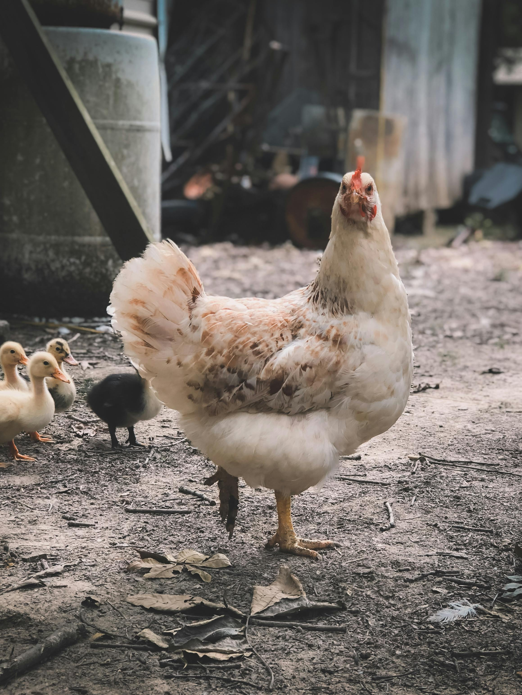
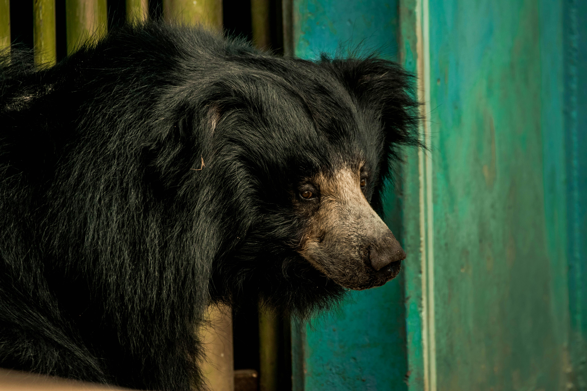
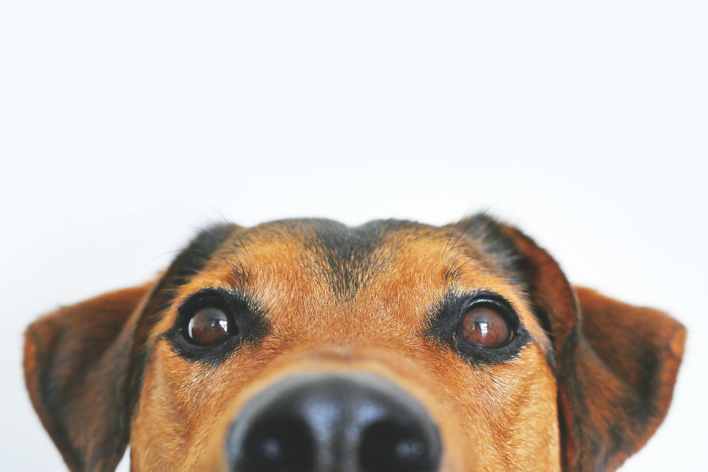

<!DOCTYPE html>
<html>
<head>
    <title>My First Page</title>
</head>
<body>
    <h1>Hello! I'm Jessica. I'm a student at <a href="https://www.fordham.edu">Fordham</a>.</h1>
    <h2> About Me! </h2>
    
I <b>love</b> to read <a href="https://www.nytimes.com" target="_blank"><i>New York Times</i> </a>.

    <!--Can use <b> or <strong> for bold lettering-->
    <!--Can use i or em for italics-->
    
Well, more like I like to play Connections and Wordle.

    
I am majoring in New Media and Digital Design with a concentration in Art,Text and Design and a minor in Creative Writing.

    <h3>My Life</h3>
    
I am the oldest of 3 kids. I have two younger brothers named Brady and John.

    
I have two dogs that I <b>love</b>. Their names are Pepper and Jack and yes, together they are the name of a cheese. Jack is the biggest chicken in the world, and Pepper is the size of a baby bear.

    
    
    <h4>My Go-To Things to Do</h4>
    
I love to watch <a href="https://youtube.com" target="_blank"> <i>Youtube</i></a> videos or Netflix. I also love to read and write. Or draw. Or gaming. I'm pretty open to anything minus skydiving.

    <h5>My sense of Humor Has Been Broken By Dad Jokes </h5>
    <h6>That's all from me!</h6>
      
    
<!--using both height and width together can distort the image. Width might be the best option to use-->
<!--Images are in-line elements, not a block element, and so they will appear next to each other. Break tags ( ) can help with that here.-->
<!--alt can make something more accesible in the event that a viewer cannot see the image.-->
</body>
<!--This is a note.-->

</html>
